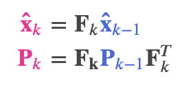
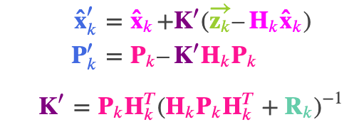

## Things I read
https://en.wikipedia.org/wiki/Kalman_filter

https://www.alanzucconi.com/2022/07/24/kalman-gain/ (detailed, links to other good sources)

http://greg.czerniak.info/guides/kalman1/ (shorter and simpler) 

https://www.bzarg.com/p/how-a-kalman-filter-works-in-pictures/#mathybits (nice diagrams and things, good for understanding a derivation)

# Kalman Filtering (linear quadratic estimation)
takes time series of measurements from multiple instruments to produce accurate estimates of ground truth
works via two-phase process: prediction and updating
kalman filter blends its guess and sensor estimates to find most likely output
under certain circumstances (e.g. gaussian error), it has been proved to be optimal

## Describing the problem with matrices
### Change dependent on state
The covariance matrix describes the correlation between the state variables
each element of the matrix Sigma_ij is the degree of correlation between the ith state variable and the jth state variable.
our best estimate is the state vector $\hat{{x}}_k$ and the covariance matrix $P_k$
We need another matrix $F_k$ to transform the state at step k-1 to the state at step k. This is our prediction matrix
e.g. if the state variables were position and velocity it might be $v_k=v_{k-1}, s_k=s_{k-1}+v_{k-1}*dt$, which is simple enough to represent with a matrix [[1,dt],[0,1]] * x_{k-1}
We need another matrix to update the covariance, which we get with the identity $Cov(Ax)=A\Sigma A^T$ given $Cov(x)=\Sigma$
### Change independent of state (External influence)
We might have some knowledge of acceleration by e.g. wind
we could update our models for state to include this:

$s_k = [s_{k-1} + v_{k-1}*dt] + [1/2 * (dt)^2 * a]$

$v_k = v_{k-1} + a*dt$

In this example we then put acceleration into the control vector and the constant scaling factors into the control matrix

i.e. B_k = [ dt^2/2, dt ], u_k=a

We also need to model change in uncertainty due to external state like drag etc.
We say that there is some covariance Q_k
We get the expanded covariance by adding Q_k

the new best estimate is a prediction made from previous best estimate, plus a correction for known external influences.
And the new uncertainty is predicted from the old uncertainty, with some additional uncertainty from the environment.

### Converting sensor data to state with correct units

From each reading we observe, we might guess that our system was in a particular state. But because there is uncertainty, some states are more likely than others to have have produced the reading we saw.

the covariance of this uncertainty (i.e. of the sensor noise) is R_k. The distribution has a mean equal to the reading we observed, which we’ll call z_k.

So now we have two Gaussian blobs: One surrounding the mean of our transformed prediction, and one surrounding the actual sensor reading we got.

## Merging Prediction and Measurement

You can merge these gaussian blobs by multiplying them together, and re-arranging the result to get a new gaussian blob with calculatable mean and covariance:

k = sigma_0^2 / (sigma_0^2+sigma_1^2)

mu' = mu_0 + k(mu_1 - mu_0)

sigma'^2 = sigma_0^2 - k * sigma_0^2

This can also be written in matrix form easily enough

## Relevant Variables
State vector $\hat{x}_k$

Covariance matrix $P_k$

Prediction matrix $F_k$

Control Matrix $B_k$

control vector $u_k$

Sensor conversion matrix $H$

Sensor noise/covariance $R_k$

Conversion mean $z_k$

Kalman gain $K$